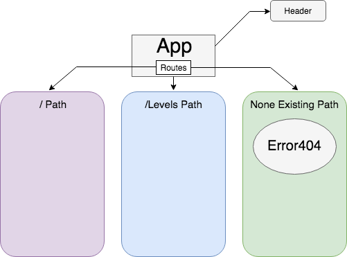

# _Tap Room_

#### _Creating a Tap Room website using react, 04/19/19_

#### By _**Ryan McLean**_

## Description

_This is a webpage that will be a work in progress. The Objective is to create a tap room style website that is functions with good design. You'll be able to view the company's current stock of beer on tap and what their levels are._

## Setup/Installation Requirements

* _Open your terminal or command prompt and input `cd desktop` then `git clone https://github.com/Lilkgb/taproom-react` to install the files onto your desktop._
* _Once downloaded, in terminal type in `cd tap-room-react` and it will take you into the correct file._
* _Run `npm install` to get all needed dependencies_
* _You may run `npm run start` to bring up a live version of the website through your local host_
* _Create a repository for yourself on github or what application you may use_
* _Copy url link thats given and run `git remote add -Your initials- -Link-` inside your terminal_
* _Push your project when ready with `git push -Your initials- -Branch name (master is default)-`_

## Diagram

## Known Bugs

_No Known bugs_

## Support and contact details

_Please contact Ryan McLean at rmcleandev@gmail.com_

## Technologies Used

_scss_
_Webpack_
_React_
_eslint_
_AOS_

### License

*This Software is Licensed under the MIT License.*

Copyright (c) 2019 **_Ryan McLean_**
